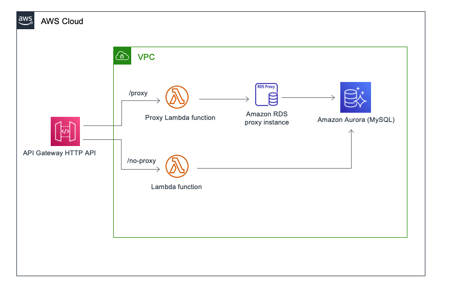
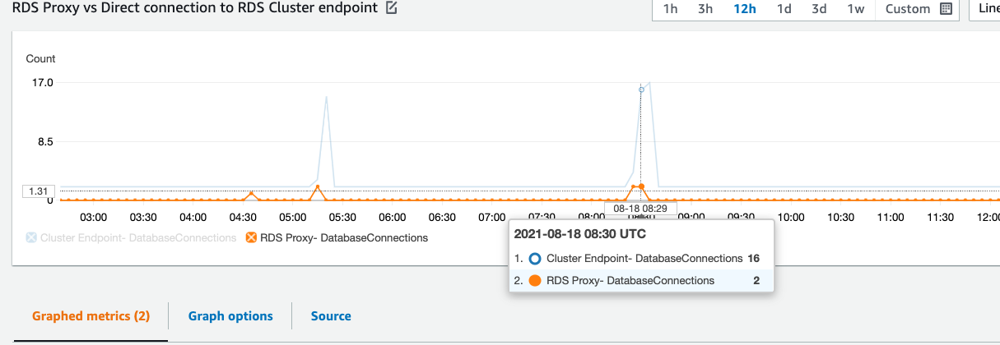
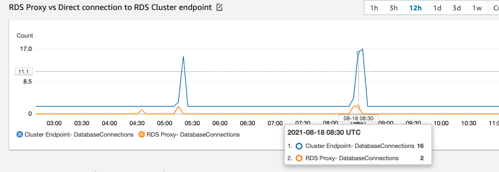

# serverless-rds-proxy-demo

This project demos benefits of using RDS proxy with serverless workload which depends on relational database like RDS Aurora.
Project shows end to end automated setup of RDS Aurora(Mysql) with RDS proxy. Basic serverless architecture is set up 
using API gateway HTTP API and Lambda Functions.

Project sets up two endpoints with HTTP API, one which talks directly to RDS Aurora cluster and the other which talks 
via RDS Proxy. It provides load testing setup to measure the benefits of using RDS proxy in terms of connection pooling 
and elasticity.

This project assumes you already have RDS Aurora Mysql cluster up and running. An RDS proxy instance
is also setup with force IAM authentication enabled. You can choose to create rds cluster with proxy following 
steps [below](#deploy-rds-aurora-cluster-with-rds-proxy) to have aurora cluster and 
RDS proxy setup.

## Architecture




## Deploy the sample application

The Serverless Application Model Command Line Interface (SAM CLI) is an extension of the AWS CLI that adds functionality for building and testing Lambda applications. 
It uses Docker to run your functions in an Amazon Linux environment that matches Lambda. It can also emulate your application's build environment and API.

To use the SAM CLI, you need the following tools.

* SAM CLI - [Install the SAM CLI](https://docs.aws.amazon.com/serverless-application-model/latest/developerguide/serverless-sam-cli-install.html)
* [Python 3.9 installed](https://www.python.org/downloads/)
* Docker - [Install Docker community edition](https://hub.docker.com/search/?type=edition&offering=community)

## Deploy RDS Aurora Cluster with RDS Proxy

**Note:** If you have already provisioned RDS Aurora cluster with RDS Proxy, you can skip 
this step and follow [these steps](#deploy-serverless-workload-using-rds-aurora-as-backend) instead.

This stack will take care of provisioning RDS Aurora Mysql along with RDS proxy fronting it inside
a VPC with 3 private subnet. Required parameters needed by [next step](#deploy-serverless-workload-using-rds-aurora-as-backend)
is also provided as stack output.

```bash
    sam build -t rds-with-proxy.yaml --use-container
    sam deploy -t rds-with-proxy.yaml --guided
```
## Deploy serverless workload using RDS Aurora as backend

To build and deploy your application for the first time, run the following in your shell:
Pass required parameters during guided deploy.

```bash
    sam build --use-container
    sam deploy --guided
```


## Load testing

### Installing artillery

We will use [artillery](https://artillery.io/docs/guides/overview/welcome.html) to generate some load towards both the apis. 
Install Artillery via npm:

```
    npm install -g artillery@latest
```

### Checking your installation

If you used npm to install Artillery globally, run the following command in your preferred command line interface:

```
    artillery dino
```

You should see an ASCII dinosaur printed to the terminal. Something like this:



### Testing

Before starting load testing, make sure `target` in files `load-no-proxy.yml` and  `load-proxy.yml` is update with the 
created HTTP API endpoint. The endpoint is also provided as stack output `ApiBasePath` when 
executing [above steps](#deploy-serverless-workload-using-rds-aurora-as-backend). You can generate load on both the APIs via:

```
    artillery run load-no-proxy.yml
```

```
    artillery run load-proxy.yml
```

For a sample load which ran 300 seconds with arrival rate for users at 100, i.e. 30000 request over 5 minutes, below is
comparison of number of database connection used when connecting via RDS proxy vs directly to RDS Aurora cluster endpoint.


 

## Security

See [CONTRIBUTING](CONTRIBUTING.md#security-issue-notifications) for more information.

## License

This library is licensed under the MIT-0 License. See the LICENSE file.