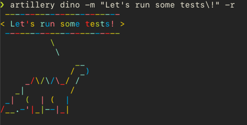

# serverless-rds-proxy-demo

This project contains source code and supporting files for a serverless application that you can deploy with the SAM CLI. It includes the following files and folders.

This project assumes you already have RDS Aurora Mysql cluster up and running. An RDS proxy instance
is also setup with force IAM authentication enabled. You can choose to follow [this workshop](https://awsauroralabsmy.com/) to have aurora cluster and 
RDS proxy setup.

## Deploy the sample application

The Serverless Application Model Command Line Interface (SAM CLI) is an extension of the AWS CLI that adds functionality for building and testing Lambda applications. It uses Docker to run your functions in an Amazon Linux environment that matches Lambda. It can also emulate your application's build environment and API.

To use the SAM CLI, you need the following tools.

* SAM CLI - [Install the SAM CLI](https://docs.aws.amazon.com/serverless-application-model/latest/developerguide/serverless-sam-cli-install.html)
* [Python 3 installed](https://www.python.org/downloads/)
* Docker - [Install Docker community edition](https://hub.docker.com/search/?type=edition&offering=community)

To build and deploy your application for the first time, run the following in your shell:

```bash
sam build --use-container
sam deploy --guided
```

## Load testing

### Installing artillery
We will use [artillery](https://artillery.io/docs/guides/overview/welcome.html) to generate some load towards both the apis.

Install Artillery via npm:

```
    npm install -g artillery@latest

```

### Checking your installation

If you used npm to install Artillery globally, run the following command in your preferred command line interface:

```
    artillery dino

```

You should see an ASCII dinosaur printed to the terminal. Something like this:



### Testing

We can generate load on both the APIs via:

```
    artillery run load-no-proxy.yml
```

```
    artillery run load-proxy.yml
```